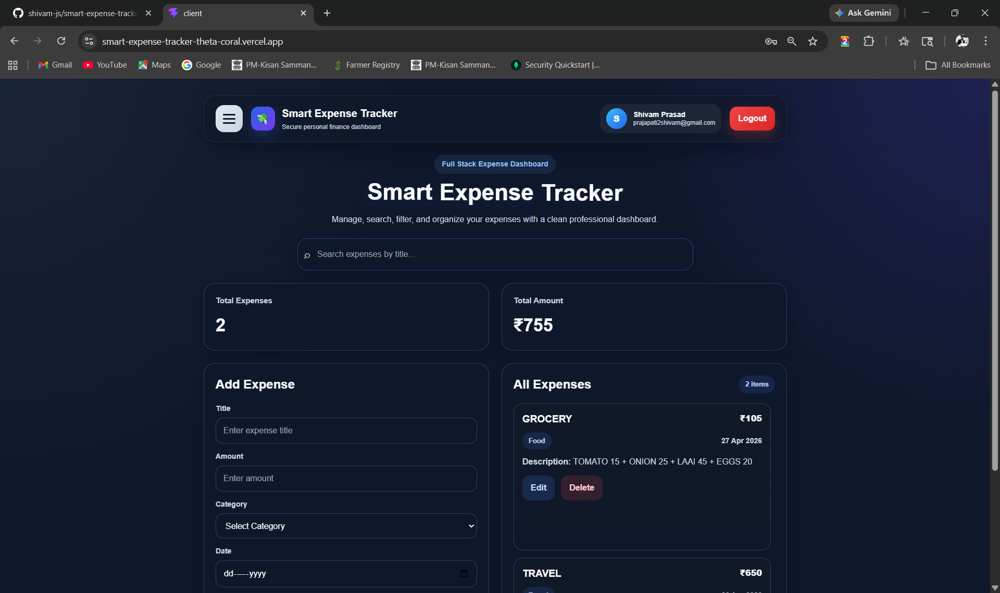
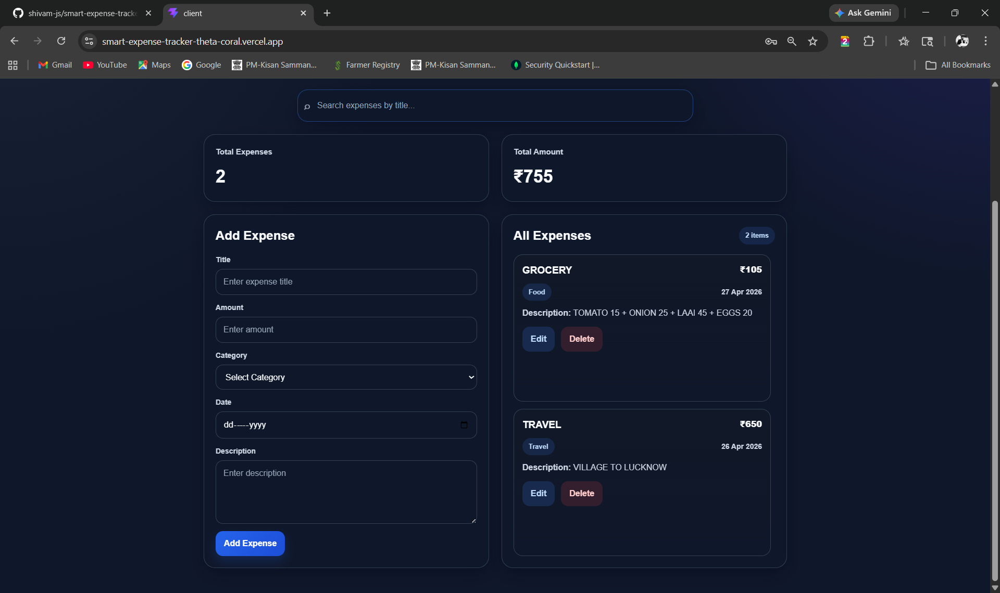
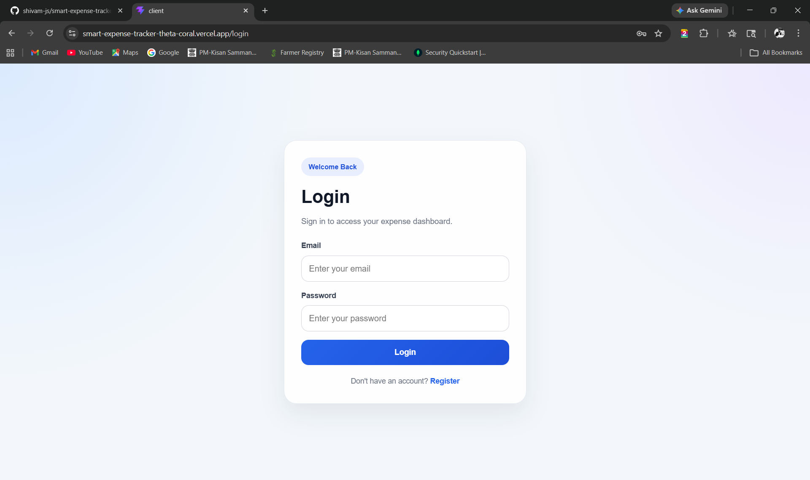
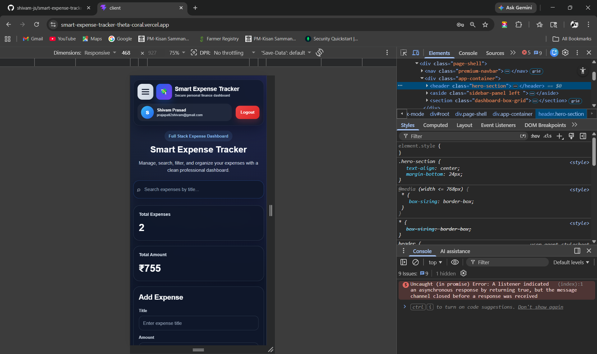
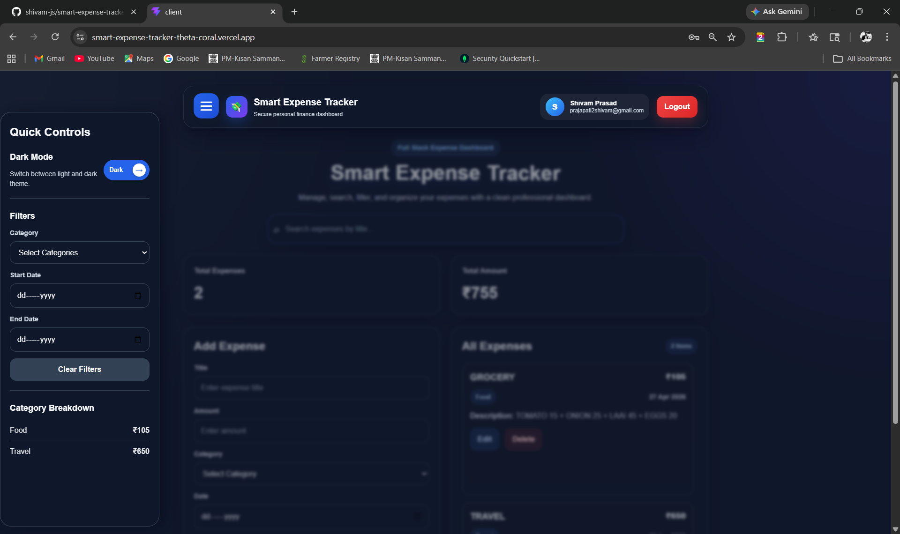

# 💸 Smart Expense Tracker

🚀 Full-stack MERN Expense Tracker with JWT authentication, REST APIs, MongoDB integration, analytics dashboard, expense categorization, and responsive modern UI.

---

## 🌐 Live Demo

Frontend 👉 https://smart-expense-trackee.netlify.app/

Backend 👉 https://smart-expense-tracker-backend-74oj.onrender.com

---

## 📌 Overview

Managing daily expenses manually is inefficient and error-prone.
This application provides a **centralized platform** to:

* Track spending
* Analyze expenses
* Manage financial habits

---

## ⚙️ Tech Stack

**Frontend**

* React.js
* JavaScript (ES6+)
* HTML5, CSS3 (Responsive Design)

**Backend**

* Node.js
* Express.js

**Database**

* MongoDB Atlas

**Authentication**

* JWT (JSON Web Tokens)

**Deployment**

* Netlify (Frontend)
* Railway (Backend)

---

## ✨ Key Features

* Secure JWT Authentication
* User-specific expense management
* Expense filtering and searching
* Dark mode support
* Responsive dashboard UI
* Full CRUD operations
* Protected routes
* Cloud deployment
---

## 🖼️ Screenshots

### 📊 Dashboard1



### 📊 Dashboard2



### 🔐 Login Page



### 📱 Mobile View



### Sidebar



---

## 🛠️ Installation & Setup

```bash
# Clone the repository
git clone https://github.com/your-username/smart-expense-tracker.git

# Go into project
cd smart-expense-tracker

# Backend setup
cd server
npm install
npm run dev

# Frontend setup
cd client
npm install
npm run dev
```

---

## 📂 Project Structure

```
smart-expense-tracker/
│
├── client/      # React frontend
├── server/      # Node.js backend
└── README.md
```

---

## 🎯 Learning Outcomes

* Built a complete **MERN stack application**
* Understood **REST API design**
* Implemented **authentication & authorization**
* Learned **deployment using Vercel & Render**
* Improved **responsive UI design skills**

---

👨‍💻 Author

Shivam Prasad

Final Year Developer passionate about Full Stack Development, AI Systems, and Modern Web Applications.

If you like this project, ⭐ the repo!
